# Тестування працездатності системи

*В цьому розділі вказуються засоби тестування, наводяться вихідні коди тестів та результати тестування.*  
*Тестування виконується за допомогою Postman*

## Запуск сервера

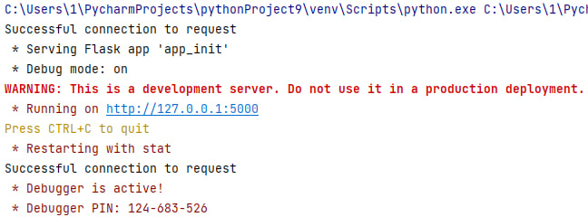

## Тестування GET

### Отримати запити

#### Запит:
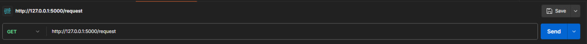

#### Результат:
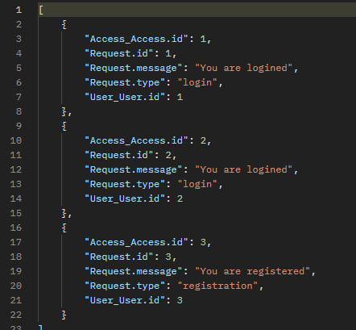

### Отримати запити по id

#### Запит:

#### Результат:
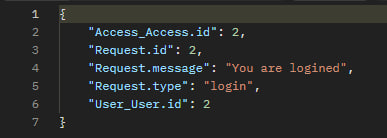

## Тестування POST

### Додати запит

#### Запит:
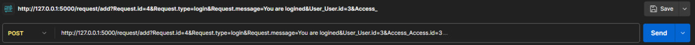

#### Результат:
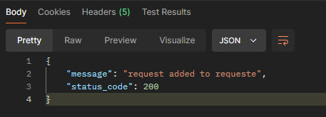

#### Перевірка за допомогою GET:
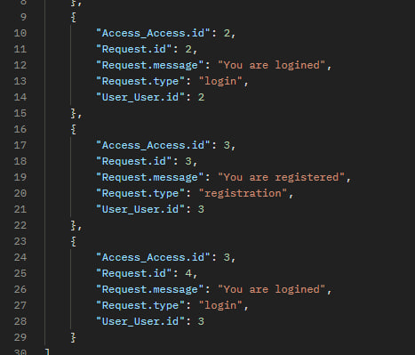

## Тестування DELETE

### Змінити запит по id

#### Запит:
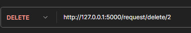

#### Результат:
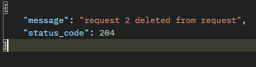

#### Перевірка за допомогою GET:

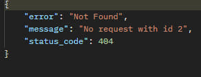

## Тестування PUT

### Видалити запит по id

#### Запит:
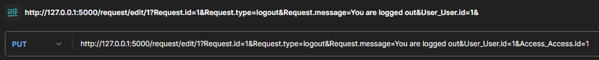

#### Результат:
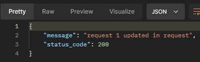

#### Перевірка за допомогою GET:

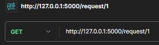

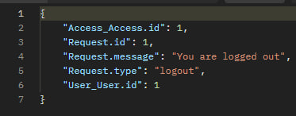

